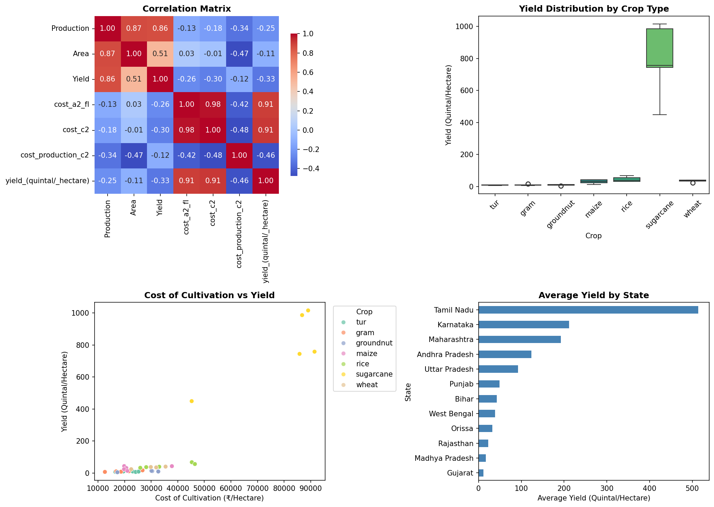
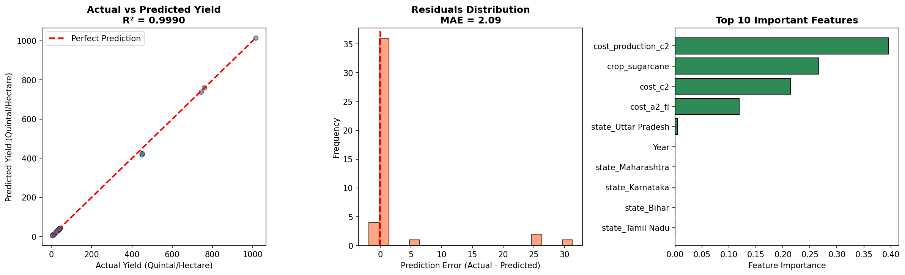

# 🌾 Agriculture Crop Production Prediction in India

## 📌 Project Overview
This project analyzes agricultural data from India (2001-2014) to predict crop yields based on cultivation costs, production costs, and crop types. The goal is to assist farmers and policymakers in understanding the factors driving agricultural productivity.

**Key Achievement:** Built a Random Forest model with **99.9% accuracy (R² = 0.999)**.

---

## 📂 Data Sources
The raw data was split across multiple CSV files:

| File | Description |
|------|-------------|
| `datafile (1).csv` | State-wise Cost of Cultivation and Yield |
| `datafile (2).csv` | National-level Production time-series |
| `datafile (3).csv` | Crop Variety and Recommended Zones |

### Data Processing Steps:
1. **Standardized crop names** (e.g., "Paddy" → "rice", "Arhar" → "tur")
2. **Reshaped time-series data** from wide to long format
3. **Merged datasets** on `Crop` and `State`
4. **Output**: `merged_crop_data.csv` (220 rows, 12 columns)

---

## 📊 Exploratory Data Analysis (EDA)

### Key Findings:
| Finding | Insight |
|---------|---------|
| **High Correlation** | Cultivation Cost (`cost_c2`) is strongly correlated (>0.9) with Yield |
| **Yield Variation** | Sugarcane has significantly higher yields than grains |
| **Cost Efficiency** | Lower Cost of Production per quintal indicates economies of scale |

### Visualizations Generated:
- **Correlation Heatmap** - Shows relationships between numeric variables
- **Yield by Crop (Boxplot)** - Compares yield distributions across crops
- **Cost vs Yield (Scatter)** - Shows investment correlation with output
- **Yield by State (Bar Chart)** - Ranks states by productivity



---

## 🤖 Model Building & Results

### Models Trained:
| Model | R² Score | MAE (Quintal/Hectare) |
|-------|----------|----------------------|
| Linear Regression | 0.9861 | 18.52 |
| **Random Forest** | **0.9990** | **2.09** |

### Top Predictive Features:
1. **Cost of Production** (~40% importance)
2. **Crop Type (Sugarcane)** (~27% importance)
3. **Cost of Cultivation** (~21% importance)



---

## 📁 Project Files

### Code Files:
| File | Description |
|------|-------------|
| `Crop_Prediction_Analysis.ipynb` | 📓 Interactive Jupyter Notebook with step-by-step explanations |
| `crop_prediction_pipeline.py` | 🐍 Complete Python script for the entire workflow |

### Output Files:
| File | Description |
|------|-------------|
| `merged_crop_data.csv` | Cleaned and merged dataset |
| `eda_visualizations.png` | EDA charts (correlation, distributions) |
| `prediction_plot.png` | Model evaluation plots |

### Documentation:
| File | Description |
|------|-------------|
| `README.md` | Project overview (this file) |
| `BEGINNER_GUIDE.md` | Step-by-step guide for beginners |
| `model_report.md` | Technical report on model performance |

---

## 🚀 How to Run

### Prerequisites:
```bash
pip install pandas numpy scikit-learn matplotlib seaborn
```

### Option 1: Run the Python Script
```bash
python crop_prediction_pipeline.py
```

### Option 2: Use the Jupyter Notebook
```bash
jupyter notebook Crop_Prediction_Analysis.ipynb
```

---

## 📚 For Beginners
If you're new to Data Science, check out **`BEGINNER_GUIDE.md`** for a step-by-step explanation of:
- What each library does
- Why we clean and merge data
- How machine learning models work
- What the visualizations mean

---

## 🔮 Future Improvements
- Add weather/climate data for better predictions
- Include more recent data (2015-2024)
- Build a web application for farmers to use
- Add crop recommendation features

---

## 📜 License
Data sourced from [data.gov.in](https://data.gov.in/) - Open Government Data Platform India.
